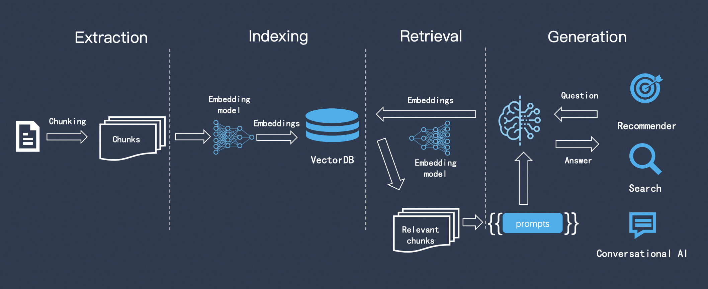
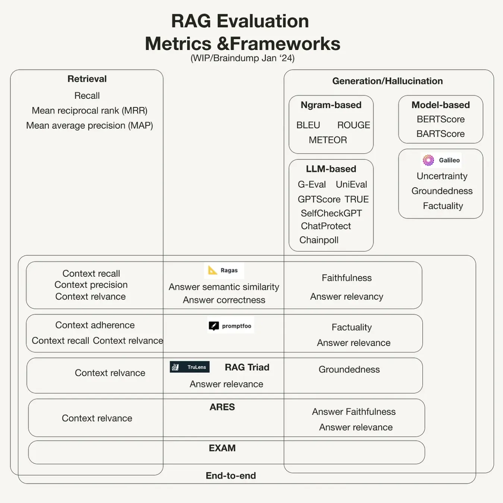

RAG（检索增强搜索）是一种AI框架，它将传统信息检索系统（例如数据库）的优势与生成式大语言模型（LLM）的功能结合在一起，通过将这些额外知识与自己的语言技能相结合，AI可以撰写更准确、更具时效性且更贴合您的具体需求的文字。

RAG通过几个主要步骤来帮助增强生成式AI输出：

- **检索和预处理**：RAG利用强大的搜索算法查询外部数据、例如网页、知识库和数据库。检索完毕后，相关信息会进行预处理，包括标记化、词干提取和停用词移除。
- **生成**：经过预处理的检索到的信息接着回无缝整合到预训练的LLM中。此整合增强了LLM的上下文，使其能够更全面地理解主题。这种增强的上下文使LLM能够生成更精确、更翔实且更具吸引力的回答。

RAG的运行方式是：首先使用从数据库中检索相关信息。然后将这种检索到的信息整合到LLM的查询输入中，使其能够生成更准确且与上下文更相关的文本。

以下是一个RAG的核心架构模式：在检索和生成之间还需要对数据做一些处理和索引的存储。

上次梳理了一些提升RAG效果的方法，然后在实际进行优化的过程中，有个比较关键的点，就是那你做了这些事情对系统的到底有什么影响，带来的收益和变化。为了系统地评估和优化RAG系统的性能，有效的评估不可少：

- 客观衡量系统性能：了解系统优势和不足，明确优化方向
- 发现并定位问题：空召回，答案冗余、检索的相关性不足等

RAG评测对于理解系统能力、优化改进方案、保障应用质量至关重要，下面分享一些最近在评测上的一些经验。

# 一、评测概述

上面提到了RAG的定义是结合信息检索和大模型生成能力，为了全面评估RAG系统的性能，我们需要分别考察其在信息检索和答案生成两个子任务上的表现：

- **评测信息检索能力**：借鉴传统IR（Information Retrieval）系统的评估方案和指标，如平均倒数排序（MRR）、精确率（Precision）、召回率（Recall）等。
- **大模型生成能力**：主要依赖于语言模型本身的性能，看答案的流畅度、连贯性、准确性等方面，可以采用人工评分、BLEU等自动化指标，以及问答准确率等任务相关指标。

在实际的系统中，检索结果的质量在很大程度上决定了RAG系统的整体性能，如果召回的文档于问题无关或信息不足，即使后续的生成模型再强大，也难以产出满意的答案。

如果召回模块能够准确、全面地检索到问题相关的背景知识，生成模型就可以在此基础上进行知识整合和答案生成，最终输出高质量的回复，只有建立在高质量召回的基础之上，RAG系统才能充分发挥大语言模型的生成能力。

因此，在影响RAG系统性能的诸多因素中，召回指标占据了相当大的权重。提升召回阶段的效果，是优化RAG系统的关键所在。

# 二、评测相关指标

## 检索指标

RAG依赖于高质量的检索结果来生成准确和信息丰富的响应。通过对RAG系统的检索部分进行评测，可以评估其在检索相关文档方面的性能。

一些流行的基本信息检索指标包括，不考虑检索文档顺序的指标：

- 精确度@k：精确度评估检索结果中的真正实例。它分析返回的结果中有多少于搜索查询相关。指标后面的“@k”描述了在评估期间分析的前k个结果。例如，精确度@5意味着前五个输出的精确度。
- 召回率@k：召回率通过分析返回的结果与数据库中所有相关项目的数量来评估IR系统。由于k值的影响很大，如果k等于整个数据集，召回率将是1。必须根据应用要求设置k值。
- F1分数@K：F1是精确度和召回率之间的调和平均值。它提供了两个指标之间的平衡，并在上述两个评估都相关时使用。

然而，排名指标受到检索结果顺序的影响。一些流行的排名指标包括：

- 平均精度均值（MAP）：MAP有两个部分。首先，它计算单个查询的多个k值（从1到N）的平均精度。第二部分取所有可能查询的平均精度的平均值。
- 归一化折扣累

